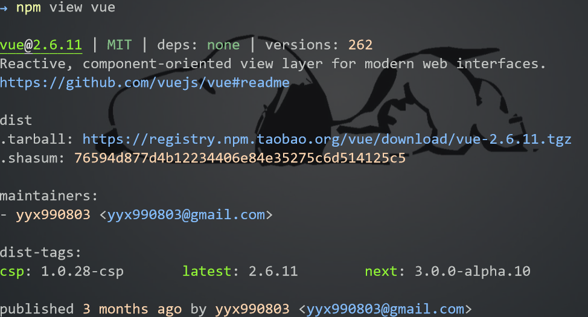

## 创建项目

我们经常使用 `npm init` 来创建项目，并按照提示输入项目信息(项目名称、作者等)，但是，如果我们并不关心项目信息，并且保留默认值，那么我们对 npm 请求的每条数据按 Enter 键即可。事实上，我们只需要使用 `npm init -y`,这个命令就可以达到直接使用默认值信息建一个项目。

## 安装模块

使用 `npm install` 来安装，你可以使用其简写 `npm i`

## 一次性安装多个模块

无需为你要安装的每个模块都输入一遍 npm i 指令，像这样：

```bash
npm i gulp-pug
npm i gulp-debug
npm i gulp-sass
```

你只需要输入一行命令即可一次性批量安装模块
`npm i gulp-pug gulp-debug gulp-sass`
更快捷的是，如果安装的所有模块的前缀是相同的，则可以这样安装，无需输入完整模块名
`npm i gulp{-debug,-sass,-pug}`

## 使用一些安装标志的快捷方式

如果你想安装一些包到 **生产环境** 依赖下面，你通常是这样安装：
`npm i gulp --save-prod`
更简化，你可以使用-P 标志，这样安装：
`npm i gulp -P`

同理，**开发环境** 下的依赖安装，你可以用-D 代替 `--save-dev`，
`npm i gulp -D`
当你不带任何安装标志时，npm 默认将模块作为依赖项目添加到 package.json 文件中。如果你想避免这样，你可以使用 no-save,这样安装：
`npm i vue --no-save`

## 获取安装包信息

使用 `npm view xxx` 或 `npm v xxx` 可以查看包信息。


- 如果你只是想看安装包最近的版本信息，你可以这样：

  ```
  > npm v vue version
  > 2.5.17
  ```

- 如果你想获取安装包完整的版本信息列表，你可以使用复数形式，例如：

  ```
  > npm v vue versions
  > [ '0.0.0',
    '0.6.0',
    '0.7.0',
    ...
    '2.5.15',
    '2.5.16',
    '2.5.17-beta.0',
    '2.5.17' ]
  ```

## 安装指定版本安装包

如果你想安装一个不是最新版本的安装包，你可以指定某个版本来安装，如：
`npm i vue@2.5.15`

鉴于记住标签比记住版本数字容易多了，你可以使用用 `npm v` 命令来查到的版本信息列表里面的 `dist-tag` 来安装,比如：
`npm i vue@beta`

## 搜索安装包

有时候你不能明确记得你曾经使用过的或者朋友推荐的包名，这种情况下，你可以使用 `npm search` 从终端直接执行搜索，如：

`npm search gulp debug`
或者
`npm s gulp debug`

## 卸载包

如果你不想转到 package.json 文件并手动删除依赖包，则可以用以下方法删除：
`npm uninstall vue`

这个命令会删除 `node_modules` 文件夹及 `package.json` 中对应的包。当然，你也可以用 rm,un 或者 r 来达到相同的效果:
`npm rm vue`

如果由于某些原因，你只想从 `node_modules` 文件夹中删除安装包，但是想在 `package.json` 中保留其依赖项，那么你可以使用 `no-save` 标志，如：
`npm rm vue --no-save`

## 依赖枚举

如果你想看一下你的项目依赖了哪些安装包，你可以这样看：

`npm ls`
这个命令会将你项目的依赖列举出来，并且各个安装包的依赖也会显示出来。如果你只想看本项目的依赖，你可以这样：

`npm ls --depth=0`
这样打印出来的结果就是本项目的依赖，像这样：

├── jquery@3.3.1├── vue@2.5.17└── yarn@1.12.3

当然，你也可以加上 g 来看看你全局安装的依赖包，如：

`npm ls -g -depth 0`

## 过期依赖枚举

大多数时候，你需要保持本地依赖的更新，你可以在项目目录下先查看一下安装包有没有版本更新，如：

`npm outdate`

## 执行测试

你可以使用 `npm run tests` 来执行测试用例，但是你可以更方便地用 `npm test` 或者 `npm t` 来执行。

## 显示可用脚本

我们可以通过打开 `package.json` 文件来查看有哪些可执行的脚本，但是我们还可以这样查看：

`npm run`
如果在 `package.json` 中有如下配置：

```json
"scripts": { "test": "jest", "build": "gulp build"}
```

那么执行这个命令之后，会显示以下信息：

```bash
Lifecycle scripts included in npm:
  test
    jest
available via `npm run-script`:
  build
    gulp-build
```

## 安装 Github Repo 上的包

你可以直接这样安装来自 Github repo 上的包：

`npm i https://github.com/sindresorhus/gulp-debug`

或者你可以忽略域名安装：

`npm i sindresorhus/gulp-debug`

## 打开安装包的 Github 主页

你当然可以直接谷歌搜索，然后找到对应的包链接打开，但是你还可以这样：

`npm repo create-react-app`

有不需要安装的包，又想看下其 github 主页的，就可以这样打开。

## 列出所有 NPM 环境的可用变量

你可以使用这个命令来列出所有 NPM 环境的可用变量：

`npm run env | grep npm_`
执行后，将会打印出这样的信息：

```
npm_config_fetch_retry_maxtimeout=60000npm_config_tag_version_prefix=v
npm_config_strict_ssl=truenpm_config_sso_type=oauth
.
.
.
```

这样变量的用处就是，可以在脚本中使用它们，还可以创建自己的变量。
